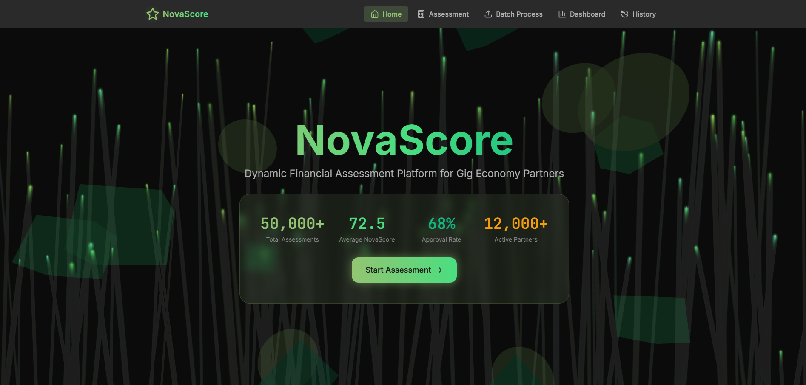
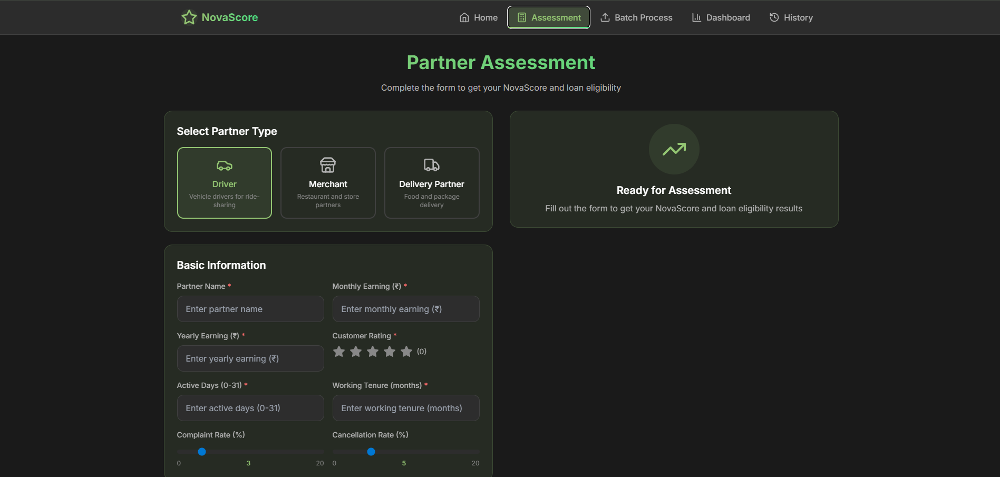
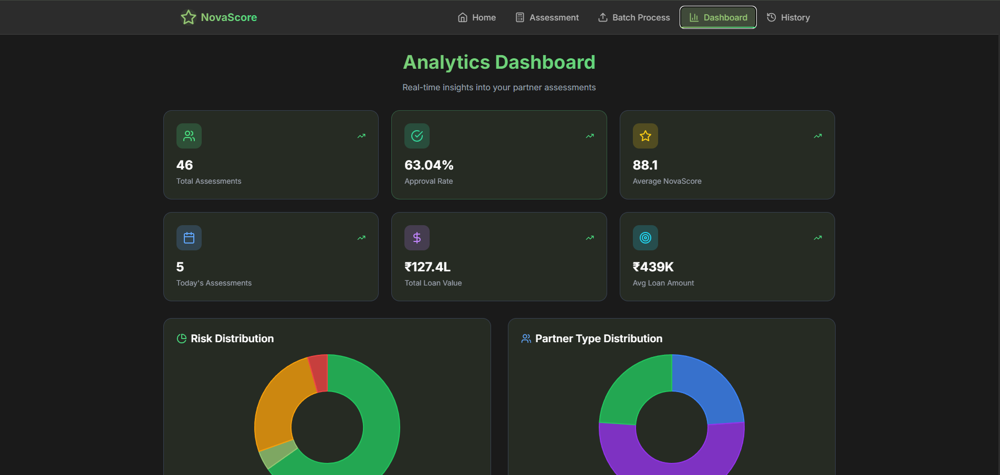

# NovaScore - AI-Powered Financial Assessment Platform

## 🏆 Grab Hackathon Submission

**NovaScore** is a dynamic financial assessment platform designed specifically for gig economy partners (drivers, merchants, and delivery partners). Using machine learning algorithms, it evaluates creditworthiness and provides personalized loan recommendations with real-time risk assessment.


## Dataset
You can access the dataset [here](https://drive.google.com/drive/folders/1jtJpbYQvm7NjqjBpK4JJAhTnB67BL8Jj).

## Kaggle Notebook
You can access the dataset [here](https://www.kaggle.com/code/anshbhardwaj1222222/team-nocap-nova).

## 🌟 Key Features

### 🤖 AI-Powered Assessment
- **Machine Learning Model**: CatBoost-based Nova Score calculation
- **33 Feature Analysis**: Comprehensive evaluation of partner performance
- **Real-time Predictions**: Instant creditworthiness scoring

### 💼 Multi-Partner Support
- **Drivers**: Vehicle-based ride-sharing assessment
- **Merchants**: Restaurant and store partner evaluation  
- **Delivery Partners**: Food and package delivery scoring

### 📊 Advanced Analytics
- **Risk Categorization**: Excellent, Good, Fair, Poor classifications
- **Loan Recommendations**: Dynamic interest rates and amounts
- **Performance Insights**: AI-generated improvement suggestions

### 🚀 Enterprise Features
- **Batch Processing**: CSV upload for bulk assessments
- **Real-time Dashboard**: Comprehensive analytics and insights
- **Historical Tracking**: Complete assessment history
- **Export Capabilities**: Data export functionality

## 🏗️ System Architecture

```
┌─────────────────┐    ┌─────────────────┐    ┌─────────────────┐
│   React Frontend │────│  Flask Backend  │────│  SQLite Database│
│                 │    │                 │    │                 │
│  • Assessment   │    │ • ML Pipeline   │    │ • Assessments   │
│  • Dashboard    │    │ • API Routes    │    │ • History       │
│  • Analytics    │    │ • Data Proc.    │    │ • Statistics    │
└─────────────────┘    └─────────────────┘    └─────────────────┘
                              │
                    ┌─────────────────┐
                    │   ML Models     │
                    │                 │
                    │ • CatBoost      │
                    │ • Scaler        │
                    │ • Encoder       │
                    └─────────────────┘
```

<!-- GitHub Issues (Upload to an issue and copy URL) -->


<!-- Relative path (recommended) -->


<!-- External hosting -->



## 📁 Project Structure

```
novascore/
├── backend/
│   ├── app.py                          # Main Flask application
│   ├── best_nova_score_model.pkl       # Trained CatBoost model
│   ├── feature_scaler.pkl              # Feature standardization
│   ├── partner_type_encoder.pkl        # Partner type encoding
│   ├── model_info.json                 # Model metadata
│   ├── model_performance_results.csv   # Model evaluation metrics
│   └── novascore.db                    # SQLite database
├── src/
│   ├── components/
│   │   └── 3D/
│   │       ├── FloatingShapes.tsx      # 3D background animations
│   │       ├── NovaScoreRing.tsx       # 3D score visualization
│   │       ├── NavbarContext.tsx       # Navigation context
│   │       └── ParticlesBackground.tsx # Particle effects
│   ├── context/
│   │   └── AppContext.tsx              # Global state management
│   └── pages/
│       ├── Assessment.tsx              # Partner assessment form
│       ├── BatchAssessment.tsx         # Bulk processing interface
│       ├── Dashboard.tsx               # Analytics dashboard
│       ├── History.tsx                 # Assessment history
│       └── Landing.tsx                 # Homepage
├── App.tsx                             # Main React application
├── main.tsx                            # Application entry point
├── vite-env.d.ts                       # TypeScript definitions
├── eslint.config.js                    # Code linting rules
├── package.json                        # Dependencies
├── postcss.config.js                   # PostCSS configuration
├── tailwind.config.js                  # Tailwind CSS config
├── tsconfig.json                       # TypeScript config
├── tsconfig.node.json                  # Node TypeScript config
└── vite.config.ts                      # Vite build config
```

## 🚀 Quick Start

### Prerequisites
```bash
# Backend Requirements
Python 3.8+
Flask
Scikit-learn
CatBoost
Pandas
NumPy

# Frontend Requirements  
Node.js 16+
React 18+
TypeScript
Vite
```

### Installation

1. **Clone Repository**
```bash
git clone https://github.com/your-username/novascore.git
cd novascore
```

2. **Backend Setup**
```bash
cd backend
pip install -r requirements.txt

# Start Flask server
python app.py
# Server runs on http://localhost:8000
```

3. **Frontend Setup**
```bash
# Install dependencies
npm install

# Start development server
npm run dev
# Application runs on http://localhost:5173
```

### Environment Variables
```bash
# Backend (.env)
GOOGLE_API_KEY=your_gemini_api_key_here
FLASK_ENV=development
DATABASE_URL=sqlite:///novascore.db

# Frontend (.env)
VITE_API_BASE_URL=http://localhost:8000/api
```

## 📱 Application Pages

### 🏠 Landing Page (`Landing.tsx`)
**Purpose**: Platform introduction and navigation hub

**Features**:
- Animated 3D background with floating shapes
- Real-time platform statistics
- Key metrics display (50,000+ assessments, 72.5 average score)
- Call-to-action for assessments
- Professional branding and visual hierarchy

**UI Components**:
- Hero section with animated counters
- Statistics cards with icons
- Particle background effects
- Responsive navigation bar

---

### 📋 Assessment Page (`Assessment.tsx`)
**Purpose**: Individual partner evaluation interface

**Features**:
- **Partner Type Selection**: Driver, Merchant, Delivery Partner
- **Dynamic Forms**: Context-aware input fields based on partner type
- **Real-time Validation**: Input validation and error handling
- **Progress Indicators**: Visual feedback during assessment
- **Results Display**: Nova Score, risk category, loan eligibility

**Form Sections**:
- Basic Information (name, earnings, rating)
- Performance Metrics (active days, tenure)
- Partner-specific Fields:
  - **Driver**: Vehicle age, trip distance, peak hours
  - **Merchant**: Order value, preparation time, retention rate
  - **Delivery**: Delivery time, success rate, batch efficiency

**ML Integration**:
- 33-feature analysis
- Real-time score prediction
- Risk categorization (Excellent/Good/Fair/Poor)
- Personalized improvement recommendations

---

### 📊 Dashboard Page (`Dashboard.tsx`)
**Purpose**: Comprehensive analytics and insights platform

**Key Metrics Cards**:
- **Total Assessments**: 46 completed evaluations
- **Approval Rate**: 63.04% loan approval percentage
- **Average NovaScore**: 88.1 platform-wide score
- **Today's Assessments**: 5 daily evaluations
- **Total Loan Value**: ₹127.4L in approved loans
- **Average Loan Amount**: ₹439K per approval

**Visualization Components**:
- **Risk Distribution Pie Chart**: 
  - Excellent (Green): High-performing partners
  - Good (Blue): Stable partners
  - Fair (Orange): Moderate risk partners
  - Poor (Red): High-risk partners

- **Partner Type Distribution**:
  - Driver partnerships
  - Merchant partnerships
  - Delivery partner breakdown

**Advanced Features**:
- Interactive charts with hover effects
- Real-time data updates
- Export functionality for reports
- Filtering and date range selection

---

### 🔄 Batch Process Page (`BatchAssessment.tsx`)
**Purpose**: Bulk assessment processing for enterprise clients

**Features**:
- **CSV Upload Interface**: Drag-and-drop file upload
- **Template Download**: Pre-formatted CSV templates
- **Bulk Processing**: Multiple partner assessments simultaneously
- **Progress Tracking**: Real-time processing status
- **Results Export**: Downloadable assessment reports

**Processing Pipeline**:
1. CSV validation and parsing
2. Data preprocessing and feature engineering
3. ML model batch prediction
4. Results compilation and storage
5. Summary report generation

**Error Handling**:
- Invalid file format detection
- Missing data handling
- Processing failure recovery
- Detailed error reporting

---

### 📚 History Page (`History.tsx`)
**Purpose**: Historical assessment tracking and management

**Features**:
- **Assessment Timeline**: Chronological assessment history
- **Search and Filter**: Partner name, type, date range filtering
- **Detailed Records**: Complete assessment information
- **Export Options**: Individual or bulk data export
- **Performance Trends**: Historical score analysis

**Data Display**:
- Assessment ID and timestamp
- Partner information and type
- Nova Score and risk category
- Loan decision and amount
- Assessment status

## 🧠 Machine Learning Pipeline

### Model Architecture
```python
CatBoost Regression Model
├── Input Features: 33 engineered features
├── Architecture: Gradient boosting trees
├── Training: Historical partner data
└── Output: Nova Score (0-100)
```

### Feature Engineering
**Base Features**: Monthly earnings, customer rating, active days, tenure
**Derived Features**: 
- Earning consistency ratio
- Activity per tenure
- Performance efficiency metrics
- Risk indicators (complaint/cancellation rates)

### Model Performance
- **Algorithm**: CatBoost Regressor
- **Features**: 33 comprehensive metrics
- **Accuracy**: Optimized for financial assessment
- **Real-time**: Sub-second prediction times

## 🔌 API Documentation

### Core Endpoints

#### Partner Assessment
```http
POST /api/assess-partner
Content-Type: application/json

{
  "partner_type": "driver",
  "partner_data": {
    "partner_name": "John Doe",
    "monthly_earning": 3000,
    "yearly_earning": 36000,
    "customer_rating": 4.2,
    "active_days": 25,
    "working_tenure_ingrab": 12,
    "total_trips": 200,
    "vehicle_age": 2,
    "trip_distance": 8.5,
    "peak_hours_ratio": 0.4
  }
}
```

#### Batch Processing
```http
POST /api/batch-assess
Content-Type: multipart/form-data

file: partners.csv
```

#### Dashboard Statistics
```http
GET /api/dashboard-stats
```

#### Assessment History
```http
GET /api/assessment-history?limit=100
```

### Response Format
```json
{
  "assessment_id": "uuid-string",
  "partner_type": "driver",
  "nova_score": 72.5,
  "risk_category": "Good",
  "loan_decision": {
    "approved": true,
    "max_amount": 90000,
    "interest_rate": 12.5,
    "tenure_months": 24
  },
  "recommendations": [
    "💰 Consider increasing active working hours",
    "⭐ Focus on improving customer service",
    "📈 Maintain consistent monthly earnings"
  ],
  "model_used": "CatBoost"
}
```

## 🎯 Business Logic

### Nova Score Calculation
- **Earnings Weight**: 35% - Monthly/yearly income analysis
- **Rating Weight**: 25% - Customer satisfaction scores
- **Activity Weight**: 20% - Active days and consistency
- **Experience Weight**: 10% - Platform tenure
- **Partner Bonus**: 5% - Type-specific performance metrics
- **Quality Penalty**: Complaint and cancellation rate deductions

### Loan Decision Matrix
| Nova Score | Max Amount | Interest Rate | Tenure |
|------------|------------|---------------|---------|
| 80-100     | 40x Monthly | 10.5%        | 36 months |
| 65-79      | 30x Monthly | 12.5%        | 24 months |
| 50-64      | 20x Monthly | 15.0%        | 18 months |
| 45-49      | 15x Monthly | 18.0%        | 12 months |
| <45        | Not Eligible | -           | -       |

## 🔧 Technical Implementation

### Frontend Technologies
- **React 18**: Modern hooks and concurrent features
- **TypeScript**: Type-safe development
- **Tailwind CSS**: Utility-first styling
- **Three.js**: 3D graphics and animations
- **Vite**: Fast build tooling
- **Context API**: State management

### Backend Technologies
- **Flask**: Python web framework
- **SQLite**: Lightweight database
- **CatBoost**: ML model framework
- **Pandas/NumPy**: Data processing
- **scikit-learn**: Feature preprocessing
- **CORS**: Cross-origin resource sharing

### DevOps & Deployment
- **Git**: Version control
- **ESLint**: Code quality
- **TypeScript**: Static typing
- **PostCSS**: CSS processing
- **Environment Variables**: Configuration management

## 🏆 Hackathon Highlights

### Innovation Points
1. **AI-First Approach**: ML-driven financial assessment
2. **Real-time Processing**: Sub-second evaluation times
3. **Multi-Partner Support**: Comprehensive gig economy coverage
4. **Visual Excellence**: 3D animations and modern UI
5. **Enterprise Ready**: Batch processing and analytics

### Technical Achievements
- **33-Feature ML Model**: Comprehensive partner evaluation
- **Real-time Predictions**: Instant creditworthiness scoring  
- **Scalable Architecture**: Production-ready infrastructure
- **Modern UI/UX**: Engaging 3D visual experience
- **Complete Solution**: End-to-end assessment platform

### Business Impact
- **Financial Inclusion**: Democratized access to credit
- **Risk Assessment**: Data-driven lending decisions
- **Partner Growth**: Personalized improvement recommendations
- **Operational Efficiency**: Automated assessment workflows

## 📈 Future Roadmap

### Phase 1: Enhanced ML
- Advanced ensemble models
- Real-time model updates
- A/B testing framework

### Phase 2: Integration
- Grab platform API integration
- Payment gateway connectivity
- Mobile application development

### Phase 3: Scale
- Multi-region deployment
- Advanced analytics dashboard
- Regulatory compliance features

## 👥 Team & Contributions

**Developed for Grab Hackathon** - A comprehensive financial assessment platform showcasing modern web development, machine learning integration, and user experience design.

## 📄 License

This project is developed for the Grab Hackathon and contains proprietary algorithms and models.

---

*Built with ❤️ for the Grab Hackathon - Transforming gig economy financial assessments through AI and modern web technology.*
